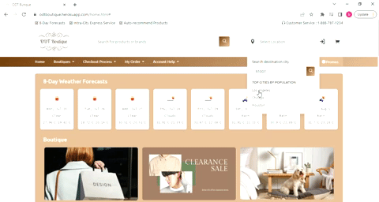
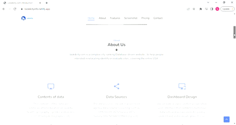
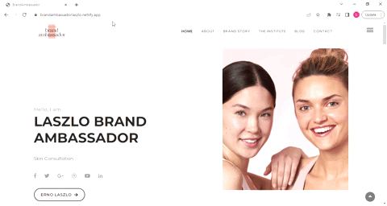
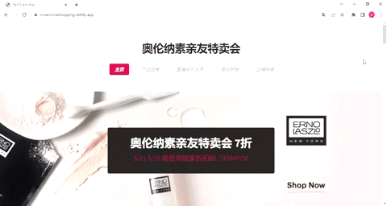
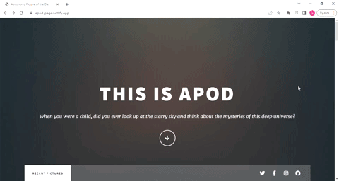

  
  
  
  
  

I am a software engineer experienced in HTML, CSS, JavaScript, SQL, SSIS, and Power BI. I like the industry. I like the people I meet. And I like doing web development. Hopefully, we can cross paths in the real world someday and collaborate on a project.

See [my website](https://sisisoftware.netlify.app/) for more information!

<h1 align="center">Projects</h1>
<table bordercolor="#66b2b2">
  
  <tr>
    <td width="50%" valign="top">
      <h3 align="center">odtboutique.store</h3>
         
        
         
        

          
    
  
      

        
<strong>Javascript, Bootstrap, jQuery, ajax , Node.js, Express.js & MangoDB </strong> - This project is a webpage that can implant into any mature commercial website or affiliate marketing program. 

    </td>
    <td width="50%" valign="top">
      <h3 align="center">look4city.com</h3>
         
      
         
        

          
  
  
      

        
<strong>HTML, CSS , SSIS & Microsoft SQL Server</strong> - Database-driven website to help people intersted in relocating identify or evaluate cities.

    </td>
  </tr>
  
  <tr>
    <td width="50%" valign="top">
      <h3 align="center">sisi-software</h3>
       
        
       
        

  
  
      

        
<strong>HTML5, CSS3, & Javascript</strong> - Portfolio Site including links to my projects and ways to get in contact with me.

    </td>
    <td width="50%" valign="top">
      <h3 align="center">ERNO LASZLO Brand Ambassador program</h3>
         
        
         
        

          
  
  
      

        
<strong>HTML5, CSS3, & Javascript</strong> - Erno Laszlo Brand Ambassadors are following Dr. Laszlo's process and making themselves available for Virtual Skincare Consultations to assess and prescribe solutions for achieving your best skin using Erno Laszlo products.

    </td>
  </tr>

  <!-- Add more projects  -->
   <tr>
    <td width="50%" valign="top">
      <h3 align="center">Friend & Family Sales Event</h3>
         
        
         
        

          
    
  
      

        
<strong>HTML , CSS & JavaScript </strong>The business strategy and web technology production are fully integrated and use the multilingual advantage to expand the sales scope and customer population—increasing sales in a short period. 

    </td>
    <td width="50%" valign="top">
      <h3 align="center">THIS IS APOD</h3>
         
      
         
        

          
  <a href="https://github.com/apod" target="_blank">
</table>

<h1 align="center">Technologies</h1>

    
    
    
    
    
    
    
    
    
    
    
    

---

<h1 align="center">Connect</h1>

  
  
  
  
  

